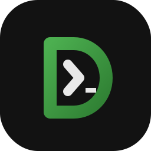

<p align="center">
  
</p>

<h1 align="center">DietCode</h1>

<p align="center">
  <strong>A native, local-first macOS coding environment with a bundled deterministic agent runtime.</strong><br>
  <em>C++20 core · AppKit shell · Agent Bridge · runtime journal · agent reliability evaluation</em>
</p>

<p align="center">
  <a href="LICENSE"></a>
  
  
</p>

---

## What this is

DietCode is a smaller, calmer, native macOS coding environment built from a portable C++20 core with an Objective-C++ / AppKit shell.

No Electron.  
No Chromium.  
No background indexing tax.  
No cloud defaults.

**Open. Code. Run. Save. No jet engine.**

DietCode also ships with a bundled deterministic agent runtime: a hardened local control stack that allows external or local agents to safely search, patch, verify, and recover against a live workspace through a stable Agent Bridge API.

You install one app.  
Humans get a native editor.  
Agents get a deterministic operating layer.

---

## Agent Runtime Reliability (v1.0)

DietCode includes a **research-grade evaluation harness** for bounded agent code mutation — not a pass-rate leaderboard, but a defensible artifact with adversarial traps, adaptive orchestration, replayable mutation traces, and enforced release gates.

**Start here:** [AGENT_RUNTIME_RELIABILITY.md](AGENT_RUNTIME_RELIABILITY.md)

```text
benchmark → adversarial traps → orchestrator → semantic repair
  → traces → provenance → replay → gates → negative gates → audit verdict
```

| Milestone | Achievement |
|-----------|-------------|
| 40-task corpus | Reference **80/80** solvability (001–030 + 051–060 nightmare) |
| Contract ladder | Static profiles → nightmare **9/10** at `contract_full` |
| Adaptive orchestrator | Three-axis escalation → nightmare **10/10** |
| Mutation traces | SLSA-style provenance per orchestrated run |
| Release gates | `make benchmark-contract-release-check` |
| Production audit | [AUDIT v1.0](benchmarks/agent_success/AUDIT_AGENT_RUNTIME_RELIABILITY_v1.0.md) |

```bash
# Validate schemas (offline)
make test-agent-benchmark-schema

# Full release gate (requires DietCode server)
make benchmark-contract-release-check
```

Tag: `agent-runtime-reliability-v1.0` · Benchmark docs: [benchmarks/agent_success/README.md](benchmarks/agent_success/README.md)

**v1.0 is frozen.** Future benchmark work goes on the **v1.1 experimental** line.

---

## Architecture

```text
  [ External agents ]     [ Human developer ]
         |                        |
   Agent Bridge              Native Cocoa UI
   (TypeScript, bundled)     (editor, tabs, terminal)
         |                        |
         +------------+-----------+
                      |
            DietCode Runtime RPC
            (~/.dietcode/control.sock)
                      |
         +------------+-----------+
         |                        |
   C++ mutation kernel    BroccoliQ runtime journal
   (patch, stale guards)  (timeline, receipts, replay)
                      |
              Agent Success Benchmark
              (traps, orchestrator, traces, gates)
```

| Layer | Role | Who uses it |
|-------|------|-------------|
| **Agent Bridge** | Stable workflows — `safePatchFile`, `searchLiteral`, recovery handling | External / local agents |
| **Runtime RPC** | JSON-RPC dispatch, queues, contracts | Bridge adapters |
| **C++ mutation kernel** | Mutation authority — `expectBeforeHash`, receipts, atomic batch | Source of truth for all writes |
| **Runtime journal** | Durable operation memory, timeline, replay, diagnostics | Runtime + agents |
| **Agent benchmark** | Adversarial evaluation, contract orchestration, mutation provenance | Researchers + CI |

Deep dive: [Agent Bridge Architecture](docs/agent-bridge-architecture.md) · [Technical Architecture](docs/technical-architecture.md) · [Agent Runtime Reliability](AGENT_RUNTIME_RELIABILITY.md).

---

## Core philosophy

DietCode is built around a few constraints:

- local-first
- deterministic behavior
- inspectable runtime surfaces
- explicit recovery paths
- bounded autonomous mutation
- no hidden ranking or semantic heuristics
- no background indexing daemons
- no cloud dependency

The runtime is designed so agents can mutate code safely without relying on opaque retrieval systems or probabilistic patch workflows.

**The kernel decides what happened.**  
**The runtime journal remembers what happened.**  
**The benchmark proves mutation stayed bounded.**

---

## Agent Bridge (preferred integration)

The Agent Bridge ships inside `DietCode.app`.

Agents should use the bridge or the bundled CLI — **not** raw runtime RPC.

```typescript
import { DietCodeBridgeClient } from '@dietcode/agent-bridge';

const bridge = new DietCodeBridgeClient({ startApp: false });

await bridge.connect();

await bridge.searchLiteral('expectBeforeHash', {
  maxResults: 10,
});

const outcome = await bridge.safePatchFile(
  'src/foo.ts',
  unifiedDiff,
);

await bridge.close();
```

CLI:

```bash
build/DietCode.app/Contents/Resources/bin/dietcode-agent-client profile

build/DietCode.app/Contents/Resources/bin/dietcode-agent-client verify fast

build/DietCode.app/Contents/Resources/bin/dietcode-agent-client patch safe-file \
  src/foo.ts \
  /tmp/foo.patch
```

### Bridge workflows

| Method | Purpose |
|--------|---------|
| `connect()` | Runtime readiness + capability detection |
| `searchLiteral()` | Deterministic literal search |
| `searchTokens()` | Exact token search |
| `searchPaths()` | Deterministic path search |
| `safePatchFile()` | Validate → `expectBeforeHash` → apply |
| `safePatchBatch()` | Atomic batch mutation |
| `getOperationStatus()` | Timeout-safe replay recovery |
| `getTimeline()` | Runtime journal stream |
| `verifyFast()` | Quick runtime health check |

Full API and recipes: [Agent Bridge](docs/agent-bridge.md) · [Integration Guide](docs/agent-bridge-integration-guide.md) · [Bridge Audit](docs/agent-bridge-audit.md).

### Agent Chat (Hermes in IDE)

DietCode includes a native **Agent Chat sidebar** (⌘⇧A) wired to the bundled `dietcode-agent-chat` CLI — real Hermes + `dietcode_ide` + agent bridge, not a mock doctor shell.

```bash
build/DietCode.app/Contents/Resources/bin/dietcode-enable-agent --doctor
build/DietCode.app/Contents/Resources/bin/dietcode-agent-chat \
  --workspace /path/to/project --prompt "inspect this project"
```

See [Agent Chat Sidebar](docs/agent-chat-sidebar.md).

Live bounded-edit proof (sidebar/chat → Hermes → `dietcode_ide` → bridge → runtime mutation) with mutation authority audit:

```bash
make smoke-agent-chat-live
make test-agent-chat-workspace-switch
make test-mutation-authority
make test-verification-authority
```

---

## Runtime guarantees

The runtime behaves as a deterministic local transaction kernel for bounded autonomous mutation.

| Guarantee | Mechanism |
|-----------|-----------|
| Stale-write rejection | `expectBeforeHash` → `stale_content` |
| Mutation proof | `mutationReceipt`, `batchMutationReceipt` |
| Replay safety | `operation.status` + `idempotencyKey` |
| Monotonic revisions | `workspace.revision` |
| Durable runtime memory | BroccoliQ runtime journal |
| Deterministic retrieval | literal / token / path search only |
| Semantic quarantine | `search.semantic` → `4008` |
| Honest partial success | `complete`, `partial`, `warnings` |
| Safe batch mutation | atomic apply + rollback proof |
| Evaluated mutation bounds | Agent Success Benchmark + release gates |

Canonical C++ audit: [Agent Runtime Audit](docs/agent-runtime-audit.md). Reliability evaluation: [AGENT_RUNTIME_RELIABILITY.md](AGENT_RUNTIME_RELIABILITY.md). Maintainer RPC reference: [Headless Agent Control](docs/headless-agent-control.md).

---

## What DietCode is not

DietCode is not:

- Electron
- Chromium
- Qt
- extension-host infrastructure
- cloud-native IDE infrastructure
- semantic-search tooling
- embeddings-based retrieval
- fuzzy-ranking infrastructure
- telemetry-first tooling
- hidden background orchestration
- “AI that edits files behind your back”

The runtime intentionally prefers deterministic, inspectable workflows over opaque automation.

See [Anti-Scope Checklist](docs/anti-scope-checklist.md) and [MVP Scope](docs/mvp-scope.md).

---

## Quick start

### Requirements

- macOS 12+
- Xcode Command Line Tools (`xcode-select --install`)
- Node.js 18+ (bridge build only; bundled after `make app`)
- Python 3 (maintainer harnesses + benchmark)

### Build

```bash
git clone <repo-url> DietCode-IDE
cd DietCode-IDE

make test
make app
```

### Run

```bash
make run
```

Headless runtime:

```bash
make headless
make agent-ready
```

---

## Development workflow

After C++ runtime changes:

```bash
make restart-agent-server
```

Fast bridge iteration:

```bash
make agent-bridge-fast
make test-agent-bridge-fast
```

Daily runtime ladder:

```bash
make verify-agent-runtime
```

Full release ladder:

```bash
make verify-agent-runtime-full
```

Agent reliability benchmark:

```bash
make test-agent-benchmark-schema          # offline schema + audit tests
make benchmark-contract-orchestrator      # orchestrated nightmare sweep
make benchmark-contract-release-check     # v1.0 release gate
```

Details: [Build & Test System](docs/build-and-test-system.md) · [Testing Checklist](docs/testing-checklist.md) · [Benchmark README](benchmarks/agent_success/README.md).

---

## Repository layout

```text
DietCode-IDE/
  AGENT_RUNTIME_RELIABILITY.md   # v1.0 research release entry point
  src/                           # C++20 core + AppKit runtime/UI
  runtime/memory/                # BroccoliQ runtime journal
  agent-bridge/                  # Bundled TypeScript bridge
  benchmarks/agent_success/      # Agent reliability evaluation harness
  scripts/                       # Python harnesses + verification ladders
  docs/                          # Specifications and architecture docs
  tests/                         # C++ editor tests
  resources/                     # App bundle assets
```

[File Structure](docs/file-structure.md)

---

## Documentation

### Agent Runtime Reliability

- [AGENT_RUNTIME_RELIABILITY.md](AGENT_RUNTIME_RELIABILITY.md) — start here
- [Benchmark README](benchmarks/agent_success/README.md)
- [WHITEPAPER](benchmarks/agent_success/WHITEPAPER.md)
- [AUDIT v1.0](benchmarks/agent_success/AUDIT_AGENT_RUNTIME_RELIABILITY_v1.0.md)
- [Reliability case](docs/agent-runtime-reliability-case.md)

### Agent Bridge

- [Agent Bridge](docs/agent-bridge.md)
- [Agent Bridge Architecture](docs/agent-bridge-architecture.md)
- [Agent Bridge Integration Guide](docs/agent-bridge-integration-guide.md)
- [Agent Bridge Audit](docs/agent-bridge-audit.md)

### Runtime

- [Agent Runtime Audit](docs/agent-runtime-audit.md)
- [Runtime Invariants](docs/runtime-invariants.md)
- [Headless Agent Control](docs/headless-agent-control.md)
- [BroccoliQ Runtime Memory](docs/broccoliq-runtime-memory.md)
- [Error Codes](docs/error-codes.md)

### Development

- [Documentation Index](docs/README.md)
- [Build & Test System](docs/build-and-test-system.md)
- [Testing Checklist](docs/testing-checklist.md)
- [Maintainer Guide](docs/maintainer-guide.md)
- [Getting Started Tutorial](docs/getting-started-tutorial.md)
- [FAQ & Troubleshooting](docs/faq-and-troubleshooting.md)

---

## License

DietCode is open-source software released under the [MIT License](LICENSE).
