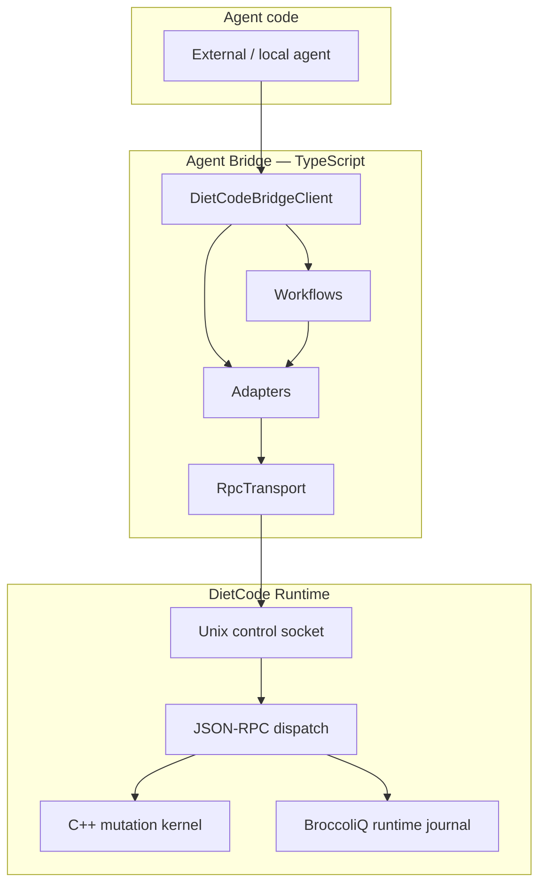
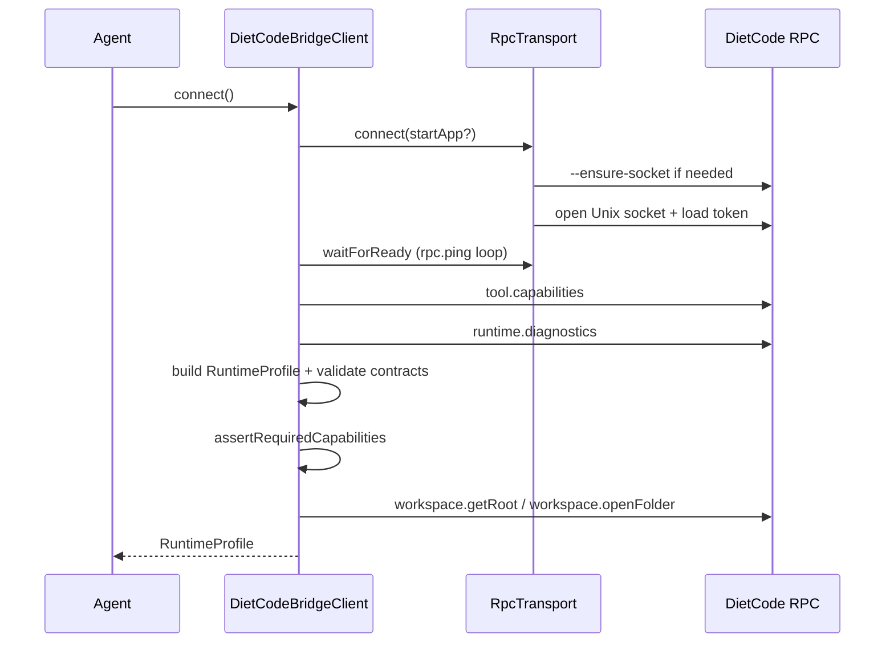
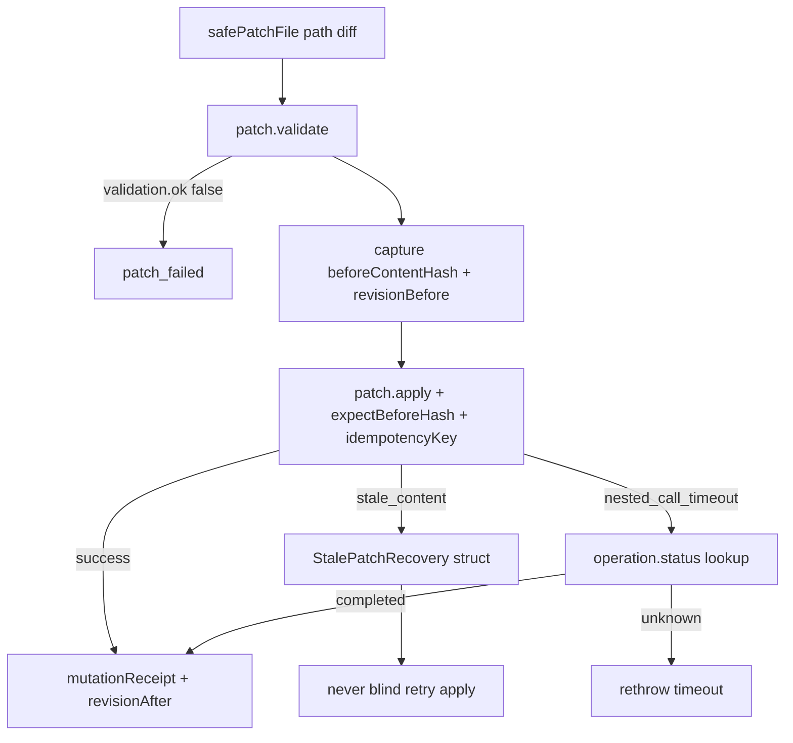

# Agent Bridge Architecture

How the DietCode Agent Bridge is structured, how it connects to the runtime, and where the module boundaries sit.

See also: [Agent Bridge](agent-bridge.md) (overview), [Agent Bridge Audit](agent-bridge-audit.md) (pass record).

---

## Layer model



**Rule:** Agent code talks only to `DietCodeBridgeClient` (or the bundled CLI). Adapters and `RpcTransport` are internal. Raw RPC names never appear in agent-facing TypeScript types or CLI command surfaces.

---

## Package layout

```text
agent-bridge/
  package.json              # @dietcode/agent-bridge
  tsconfig.json
  src/
    index.ts                # Public exports only
    client/
      DietCodeBridgeClient.ts   # Stable public API
      RpcTransport.ts           # Socket RPC (internal to package consumers)
      connection.ts             # waitForReady
      config.ts                 # Paths, limits, app binary resolution
      RuntimeProfile.ts           # Capability profile builder
    capabilities/
      detectRuntimeCapabilities.ts
    adapters/                 # Thin RPC wrappers — not exported as public API
      searchAdapter.ts
      patchAdapter.ts
      runtimeAdapter.ts
      diagnosticsAdapter.ts
      workspaceAdapter.ts
    workflows/                # Multi-step agent-safe operations
      safePatchFile.ts
      safePatchBatch.ts
      stalePatchRecovery.ts
      verifyAfterMutation.ts
    contracts/
      types.ts
      errors.ts
      BridgeError.ts
      schemas.ts              # Partial-result normalization
      validators.ts             # Frozen key parity with agent_contracts.py
    cli/
      dietcode-agent-client.ts
    testing/
      MockRpcTransport.ts     # Test-only — export via ./testing subpath
  tests/
    bridge.*.test.ts
    fixtures/
```

Built artifacts land in:

```text
DietCode.app/Contents/Resources/agent-bridge/dist/
DietCode.app/Contents/Resources/bin/dietcode-agent-client  → launcher script
```

---

## Connect lifecycle

On `await client.connect()`:



If any **required** capability is missing, connect throws `unsupported_runtime_capability` — the bridge fails loudly rather than degrading silently.

### Required capabilities

| Flag | Detection |
|------|-----------|
| `deterministicSearch` | `search.literal`, `search.tokens`, `search.paths` in `deterministicSearchMethods` |
| `patchReceipts` | `patch.apply` in `mutatingMethods` |
| `batchReceipts` | `patch.applyBatch` in `mutatingMethods` |
| `runtimeTimeline` | `runtime.timeline` in `agentSafeMethods` |
| `broccoliqJournal` | `runtime.diagnostics.available` + mutation/record authority |
| `operationStatus` | `operation.status` in `agentSafeMethods` |
| `partialSuccessEnvelopes` | diagnostics or capabilities expose `complete` / `partial` |

---

## RpcTransport design

Mirrors industry patterns from the Python client (`dietcode_agent_client.py`):

| Concern | Implementation |
|---------|----------------|
| **Serialization** | `callChain` promise queue — one request at a time per socket |
| **Framing** | Newline-delimited JSON; max 1 MiB request / 4 MiB response |
| **Frame matching** | Loop until `frame.id === requestId`; skip notification frames |
| **Timeout** | Per-call `timeoutMs`; surfaces as `nested_call_timeout` |
| **Retry** | `transportRetries` + reconnect on transport errors; read methods retry ≥1 |
| **Token refresh** | Reload `~/.dietcode/session.token` once on token `permission_denied` |
| **Schema** | `schemaVersion: 1.6.2` on every request |

### Path resolution (`config.ts`)

App binary discovery order:

1. Explicit `appPath` option
2. `DIETCODE_APP_PATH` environment variable
3. Relative to bundled CLI (`Resources/bin` → `MacOS/DietCode`)
4. `build/DietCode.app/Contents/MacOS/DietCode` from repo cwd

Socket and token defaults:

- `~/.dietcode/control.sock`
- `~/.dietcode/session.token`

---

## Workflow: safe patch



**Batch** (`safePatchBatch`) adds per-file validation, one batch idempotency key, `patch.applyBatch`, batch receipt validation, and post-failure file hash verification.

---

## Error model

All bridge failures throw `DietCodeBridgeError`:

```typescript
{
  code: BridgeErrorCode;
  message: string;
  recoveryHint: string;
  nextRecommendedCommand: string;
  retrySafe: boolean;
  rawError?: Record<string, unknown>;
}
```

Recovery hints align with `scripts/fixtures/recovery/error_recovery_hints.json` and `docs/error-codes.md`.

---

## Partial-success normalization

Read and mutation responses pass through `normalizeBridgeResult()` / `extractPartialMeta()`:

| Field | Meaning |
|-------|---------|
| `complete` | `false` when truncated or scan-limited |
| `partial` | `true` when warnings or fallback reads occurred |
| `warnings` | Stable tokens (`results_truncated`, …) |
| `fallbackUsed` | Disk read fallback was used |
| `truncated` | Result set was cut off |
| `recoveryHint` | Next safe action token |
| `nextRecommendedCommand` | RPC method hint (internal — not for agent direct use) |
| `raw` | Full RPC payload — only when `includeRaw: true` |

Agents should treat `complete: false` as a first-class outcome, not as success.

---

## Python client vs bridge

| Concern | Python `dietcode_agent_client.py` | TypeScript bridge |
|---------|-----------------------------------|-------------------|
| Audience | Maintainers, harnesses, legacy scripts | External agents, bundled CLI |
| API shape | Raw RPC method names | Stable workflow methods |
| Packaging | Repo `scripts/` | Bundled in `DietCode.app` |
| Mutation workflows | Caller composes validate + apply | `safePatchFile` / `safePatchBatch` |
| Test doubles | `harness_support.py` mocks | `MockRpcTransport` (testing subpath only) |

Both share the same socket, token, schema version, and C++ mutation authority. New agent integrations should prefer the bridge.

---

## Related

- [Agent Bridge Integration Guide](agent-bridge-integration-guide.md)
- [Runtime Invariants](runtime-invariants.md)
- [BroccoliQ Runtime Memory](broccoliq-runtime-memory.md)
