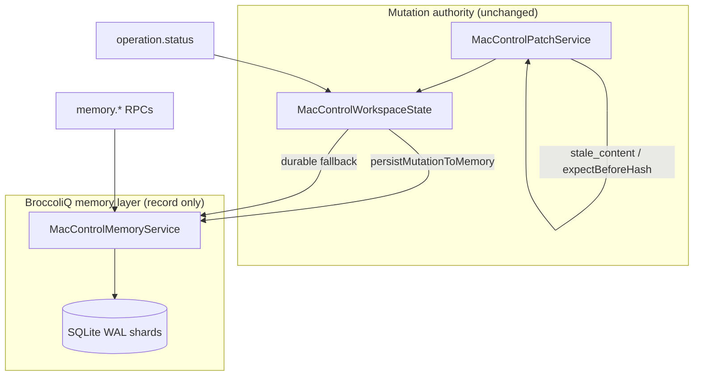

# BroccoliQ Native Runtime Memory (Pass VII)

> Pass VIII native integration: [Runtime Native Integration](runtime-native-integration.md) — timeline, identity, continuity.

BroccoliQ is embedded as the **durable memory and coordination layer** for the DietCode agent runtime. The C++ mutation kernel remains the sole authority for file correctness.

```bash
# Quick local iteration (no rebuild/restart; server + binary must already be fresh)
make test-broccoliq-runtime-memory-fast

# Full BroccoliQ memory verification (rebuilds app, restarts agent server)
make test-broccoliq-runtime-memory

# Release ladder — includes full BroccoliQ memory verification among other checks
make verify-agent-runtime-full
```

| Target | Rebuild | Restart server | When to use |
|--------|---------|----------------|-------------|
| `make test-broccoliq-runtime-memory-fast` | No | No | Day-to-day BroccoliQ iteration after `make app` + `make restart-agent-server` |
| `make test-broccoliq-runtime-memory` | Yes | Yes | Reliable pre-merge / after C++ memory-layer changes |
| `make verify-agent-runtime-full-fast` | No | No | Quick full-ladder iteration (assumes fresh server/binary) |
| `make verify-agent-runtime-full` | Yes (once) | Yes (once) | Release and full runtime closure |

**Why `verify-agent-runtime-full` felt slow:** the full target runs `make restart-agent-server`, which rebuilds the app (~60s) before any test output appears. The nested `verify_agent_runtime` step used to restart again (second rebuild). That duplicate restart is now skipped; progress lines emit before each step.

---

## Audit findings

| Area | Before | After | Risk |
|------|--------|-------|------|
| Operation history | Volatile `_completedOperations` dict only | BroccoliQ SQLite journal + volatile hot cache | Low — kernel unchanged |
| Replay cache | Lost on restart | `runtime_replay_cache` with TTL + explicit expiry | Low |
| Revision journal | Live `revisionId` only | `runtime_revisions` metadata chain | Low — no live hash replacement |
| Workflow memory | Smoke tests only, no persistence | `runtime_workflows` + `runtime_workflow_steps` | Low |
| Verification audit | `verify.last` ephemeral | `runtime_verification_runs` history | Low |
| Telemetry | NDJSON only | `runtime_telemetry_events` (droppable under backpressure) | Medium — drops allowed |
| Mutation authority | C++ kernel | **Unchanged** — BroccoliQ record-only | None |

---

## Architecture



**Integration points:**

| File | Role |
|------|------|
| `runtime/memory/broccoliq/` | Vendored BroccoliQ hive (schema reference, future TS pool) |
| `runtime/memory/runtime_memory_schema.sql` | Agent-runtime memory tables |
| `MacControlMemoryService.mm` | Native SQLite bridge (BroccoliQ-compatible persistence) |
| `MacControlServer+Memory.mm` | `memory.*` RPC dispatch |
| `MacControlWorkspaceState.mm` | Durable `operation.status` fallback + mutation journaling |
| `MacControlPatchService.mm` | Persists receipts after successful apply |
| `scripts/agent_contracts.py` | Frozen `memory.*` key sets |
| `scripts/test_broccoliq_runtime_memory.py` | Integration test suite |

---

## Memory schema summary

| Table | Purpose |
|-------|---------|
| `runtime_operations` | Full operation receipts (method, params hash, idempotency, revisions) |
| `runtime_replay_cache` | Idempotent retry results with TTL |
| `runtime_revisions` | Revision journal metadata (changed files, receipt hash) |
| `runtime_workflows` | Workflow run tracking |
| `runtime_workflow_steps` | Per-step command/status/recovery |
| `runtime_verification_runs` | Verification ladder audit trail |
| `runtime_telemetry_events` | Runtime telemetry (may drop under backpressure) |
| `runtime_error_events` | Error envelope history |
| `runtime_checkpoint` | Backpressure config and checkpoint status |

DB path: `~/.dietcode/runtime-memory/<workspace_hash>/runtime_memory.db`

---

## New RPC methods

### Operation history
- `memory.operation.get`
- `memory.operation.list`
- `memory.operation.findByIdempotencyKey`
- `memory.operation.findByRevision`
- `memory.operation.recent`

### Replay cache
- `memory.replay.get` — returns cached result or `replay_expired` with recovery guidance

### Revision journal
- `memory.revision.get`
- `memory.revision.list`
- `memory.revision.changedFiles`
- `memory.revision.lastMutation`

### Workflow memory
- `memory.workflow.start`
- `memory.workflow.step`
- `memory.workflow.complete`
- `memory.workflow.fail`
- `memory.workflow.get`
- `memory.workflow.recent`

### Verification store
- `memory.verify.record`
- `memory.verify.latest`
- `memory.verify.history`

### Status
- `memory.status` — backpressure, checkpoint, authority boundaries

---

## Safety boundaries

**BroccoliQ may store:** receipts, telemetry, operation history, workflow state, verification history, replay cache records, revision journal metadata.

**BroccoliQ must not decide:**
- Whether a patch is valid
- Whether `stale_content` applies
- Whether rollback succeeded
- Whether file content is current
- Whether a symlink is safe
- Whether search results are deterministic

Enforced via `memory.status` fields:
- `mutationAuthority: cpp_kernel`
- `memoryAuthority: broccoliq_record_only`

---

## Performance and backpressure

| Control | Default | Degraded behavior |
|---------|---------|-------------------|
| `maxMemoryBytes` | 64 MB | Report `backpressureMode: degraded` |
| `maxBufferedOperations` | 5000 | Reject new operation writes with `memory_backpressure` |
| `flushIntervalMs` | 1000 | SQLite WAL auto-flush |
| `shardCount` | 4 | Reserved for BroccoliQ hive shard expansion |
| `droppedTelemetryCount` | 0 | Telemetry may drop; receipts never silently disappear |

---

## Remaining gaps

1. **BroccoliQ TS pool not yet wired at runtime** — C++ uses compatible SQLite schema; vendored `BufferedDbPool` available for future Bun/Node co-runtime.
2. **Cross-process shard coordination** — single-process embedded mode only; multi-agent shard locking deferred.
3. **Automatic verify.run → memory.verify.record hook** — manual `memory.verify.record` required today.
4. **Replay TTL configurability** — fixed 24h retention; no RPC to tune `replayRetentionSeconds` yet.
5. **Memory compaction/prune RPC** — no `memory.prune` surface yet.

---

## Related

- [Agent Runtime Audit](agent-runtime-audit.md) — Passes I–VI
- [Runtime Invariants](runtime-invariants.md)
- [Headless Agent Control](headless-agent-control.md)
